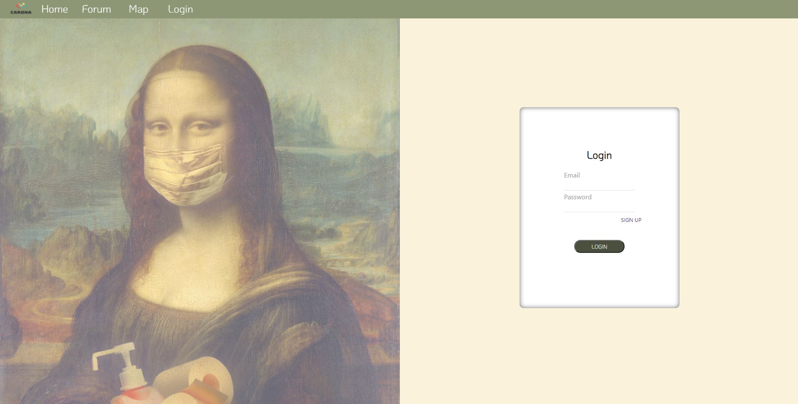
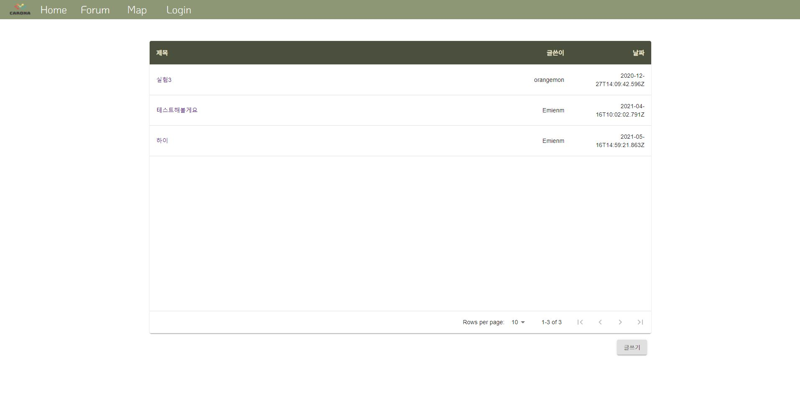

# Carona [](https://pypi.python.org/pypi/ansicolortags/)  

[](https://giphy.com/)


# Description
* Carona는 코로나 감염자의 이동경로를 카카오맵에 나타내어 코로나 감염예방을 돕는 웹 애플리케이션입니다.
* 프론트엔드 부분은 react를 활용해서 구현하였고, 백엔드 부분은 node.js와 express 프레임워크를 사용해 구현하였습니다. 데이터베이스는 MongoDB를 사용하였습니다.
* 카카오맵 API를 활용하여 코로나 감염자의 이동경로를 카카오맵에 표시하는 기능은 현재 개발단계에 있습니다.

# Installation
```js

    git clone https://github.com/EminemBurger/Carona.git

```

* git이 컴퓨터 환경에 설치되어있다면, cmd나 vscode 혹은 기타 IDE를 통해 Carona의 코드를 가져옵니다.
* git이 설치되어 있지 않다면, zip 파일로 다운받아 압축을 풉니다.

```js
    npm install
    cd client
    npm install
```


* 위의 명령을 설행하기 위해 npm과 node를 필수적으로 컴퓨터 환경에 설치하여야 합니다.
* 백엔드에서 사용되는 모듈들을 설치하기 위해 Carona 디렉터리를 현재 디렉터리로 하고, cmd나 vscode 에서 명령을 실행합니다.
* 마찬가지로 프론트에서 사용되는 모듈들을 설치하기 위해 client 디렉터리를 현재 디렉터리로 하고, 명령을 실행합니다.

```js

    npm start // in Carona folder
    cd client
    npm start // in client folder  

```

* 모듈이 성공적으로 설치되었다면, start 명령을 통해 애플리케이션을 실행시킬 수 있습니다.
* concurrently 모듈을 사용하거나, package.json에서 코드 수정을 통해 클라이언트와 서버를 동시에 실행시킬수도 있습니다.

# Functions

* 카카오맵을 통한 코로나 감염자 이동경로 확인


  
상단 메뉴의 Map 버튼을 클릭하면 감염자의 이동경로를 나타내는 카카오맵으로 이동합니다.  
지도의 아래에 위치한 Tool Box에서 원하는 도형을 클릭하고 감염자의 이동경로, 혹은 위치를 그릴 수 있습니다.  
그리고 난 후, 지도의 우측 하단에 위치한 apply 버튼을 클릭하면, 해당 이동경로를 저장할 수 있습니다.  
저장된 이동경로가 카카오맵에 표시되는 것을 확인할 수 있습니다.  
그리는 과정에서 이동경로나 위치가 잘못 그려졌다면 undo 버튼을 통해 그린 것을 지울 수 있습니다.  
redo 버튼을 통해 undo 버튼을 통해 지운 그림을 다시 그릴 수 있습니다.


```js

        useEffect(() => {
        const container = document.getElementById('myMap');
		const mapoptions = {
			center: new kakao.maps.LatLng(33.450701, 126.570667),
			level: 3
		};
        var map = new kakao.maps.Map(container, mapoptions), overlays = [];
        .
        .

```

Carona/client/components/Map.js 내에 작성된 코드를 수정함으로써 해당 기능을 변경하거나 개선시킬 수 있습니다. 카카오맵 API 홈페이지에서 문서를 참고하여 개발하면 도움이 될 수 있습니다.  
https://apis.map.kakao.com/web/documentation/ 


* 로그인, 로그아웃을 통한 사용자 식별기능  

  

상단 메뉴의 Login 버튼을 통해 로그인을 할 수 있습니다. 단, 로그인을 하기 위해선 가입이 필수적입니다.  
우측에 표시된 로그인 창에서 SIGN UP 버튼을 눌러 가입을 할 수 있습니다.  
가입을 하고 이메일과 비밀번호를 입력하면 로그인을 할 수 있습니다.

* 게시판을 통한 커뮤니케이션 기능

  

상단 메뉴의 Forum 버튼을 통해 게시판으로 이동할 수 있습니다.  
게시판을 작성, 수정, 삭제 하기위해서는 로그인을 필수적으로 해야합니다.  
작성된 게시판은 사용자의 유저명이 표시되어 사용자를 식별할 수 있습니다.

# Dependencies

## Browsers support

| [](http://godban.github.io/browsers-support-badges/)</br>IE / Edge | [](http://godban.github.io/browsers-support-badges/)</br>Chrome | 
| --------- | --------- | 
| 90.0.818.62 latest |  90.0.4430.212 latest| 

### OS 
* window 10

